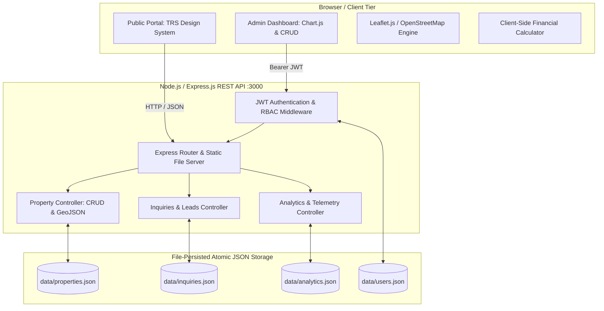
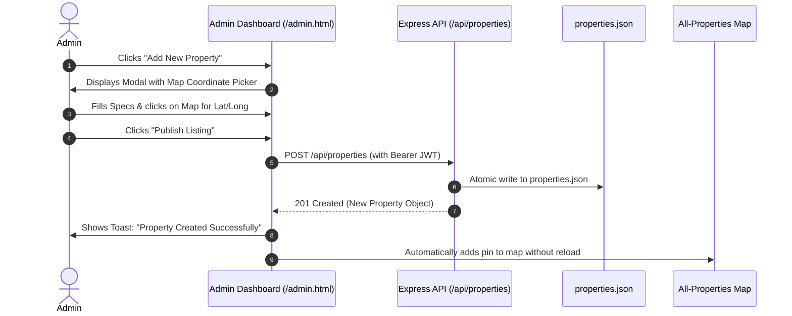

# Technical Requirements Document (TRD)

## Project Title: Shri Manibhadra Real Estate Brokers Web Platform
**Design Standard**: [TRS Property Mall](https://www.trspropertymall.com/) Architecture  
**Document Version**: 1.0.0  
**Date**: September 19, 2026  
**Status**: Ready for Implementation  

---

## 1. System Overview & Technology Stack

The platform is designed as a high-performance, full-stack real estate web application optimized for fast delivery on any device, zero native compilation issues on Windows, and zero-maintenance deployment.



### 1.1 Technology Stack Matrix

| Layer | Technology | Justification |
| :--- | :--- | :--- |
| **Runtime** | **Node.js (LTS v18+)** | High-throughput asynchronous I/O, cross-platform stability. |
| **Backend Framework** | **Express.js v4.19+** | Lightweight, robust routing, middleware ecosystem, minimal footprint. |
| **Authentication** | **jsonwebtoken (JWT) + bcryptjs** | Stateless token auth with salted password hashing. Pure JS with zero native compilation dependencies on Windows. |
| **Database Engine** | **Atomic JSON File Store (`fs/promises`)** | High-speed, zero-config persistence; no local database installation or C++ build tools required; immediate git backups. |
| **Frontend Core** | **HTML5 + Semantic CSS3 + Vanilla ES6+** | Zero build step needed, instantaneous reload, maximum performance and SEO indexing. |
| **Styling & Theme** | **TRS Property Mall Design System** | Custom CSS variables mirroring TRS Navy (`#0B192C`), Gold (`#C9A24B`), and Limestone (`#F7F6F2`). |
| **Interactive Map** | **Leaflet.js v1.9.4 + OpenStreetMap / CartoDB Voyager** | Lightweight (42KB), smooth mobile pan/zoom, custom SVG gold pins, popup cards without API key costs. |
| **Admin Charts** | **Chart.js v4.4** | Clean visual analytics: views trend lines, inquiry category doughnuts, and conversion bar charts. |
| **Iconography** | **Lucide Icons CDN** | Crisp SVG icons matching TRS Property Mall iconography. |

---

## 2. Data Architecture & Type Definitions

All persistent data structures are strictly typed and stored under the `data/` directory.

### 2.1 Property Data Model (`data/properties.json`)

```typescript
export type PropertyCategory = 'residential' | 'commercial' | 'plots' | 'luxury';
export type PropertyStatus = 'active' | 'under_offer' | 'sold';

export interface PropertyCoordinates {
  lat: number; // e.g., 23.1678
  lng: number; // e.g., 75.7892
}

export interface Property {
  id: string;                  // Unique UUID or slug prefix (e.g., "prop-ujj-001")
  title: string;               // e.g., "Emerald Horizon Luxury 3 BHK"
  slug: string;                // e.g., "emerald-horizon-nanakheda"
  category: PropertyCategory;  // 'residential' | 'commercial' | 'plots' | 'luxury'
  type: string;                // 'Flat' | 'Villa' | 'Shop' | 'Office' | 'Plot' | 'Land'
  price: number;               // Numeric in INR (e.g., 14500000 for ₹1.45 Cr)
  priceDisplay: string;        // Formatted display string: "₹1.45 Cr" or "₹75.00 L"
  pricePerSqft?: string;       // e.g., "₹6,041/sq.ft"
  areaSqft: number;            // e.g., 2400
  bedrooms?: number;           // e.g., 3
  bathrooms?: number;          // e.g., 3
  locality: string;            // e.g., "Nanakheda, Ujjain"
  address: string;             // Detailed street address
  coordinates: PropertyCoordinates;
  images: string[];            // URLs of property photos
  description: string;         // Comprehensive overview
  amenities: string[];         // ["Covered Parking", "24/7 Security", "Power Backup"]
  status: PropertyStatus;      // 'active' | 'under_offer' | 'sold'
  isFeatured: boolean;         // Featured on homepage carousel/grid
  views: number;               // Cumulative view counter
  createdAt: string;           // ISO 8601 string
  updatedAt: string;           // ISO 8601 string
}
```

### 2.2 User & Admin Data Model (`data/users.json`)

```typescript
export type UserRole = 'admin' | 'staff' | 'client';

export interface User {
  id: string;                  // e.g., "usr-admin-01"
  name: string;                // e.g., "Shri Manibhadra Admin"
  email: string;               // Unique index (e.g., "admin@manibhadrarealestate.com")
  passwordHash: string;        // bcrypt hash
  role: UserRole;              // 'admin' | 'staff' | 'client'
  createdAt: string;           // ISO 8601 string
}
```

### 2.3 Inquiry & Lead Data Model (`data/inquiries.json`)

```typescript
export type InquiryStatus = 'new' | 'contacted' | 'followup' | 'closed';

export interface Inquiry {
  id: string;                  // e.g., "inq-20260919-001"
  name: string;                // Client full name
  phone: string;               // Client phone (e.g., "+91 98260 12345")
  email?: string;              // Client email
  propertyId?: string;         // Linked property ID
  propertyTitle?: string;      // Cached title for quick display
  serviceInterest?: string;    // If inquiry came from services section
  message: string;             // Client message or requirement
  source: 'whatsapp_click' | 'web_form' | 'call_click';
  status: InquiryStatus;       // 'new' | 'contacted' | 'followup' | 'closed'
  timestamp: string;           // ISO 8601 string
  ipAddress?: string;
}
```

### 2.4 Analytics Data Model (`data/analytics.json`)

```typescript
export interface DailyView {
  date: string;                // "YYYY-MM-DD"
  views: number;
}

export interface AnalyticsData {
  totalViews: number;
  totalInquiries: number;
  dailyViews: DailyView[];
  categoryViews: Record<PropertyCategory, number>;
  localityInterest: Record<string, number>;
  lastUpdated: string;
}
```

---

## 3. RESTful API Specifications

All endpoints follow RESTful conventions and return standard JSON payloads:
`{ "success": boolean, "data"?: any, "error"?: string, "message"?: string }`.

### 3.1 Authentication Endpoints

#### `POST /api/auth/login`
* **Access**: Public
* **Payload**:
  ```json
  { "email": "admin@manibhadrarealestate.com", "password": "Admin@12345" }
  ```
* **Response (200 OK)**:
  ```json
  {
    "success": true,
    "token": "eyJhbGciOiJIUzI1NiIsInR5cCI6IkpXVCJ9...",
    "user": {
      "id": "usr-admin-01",
      "name": "Shri Manibhadra Admin",
      "email": "admin@manibhadrarealestate.com",
      "role": "admin"
    }
  }
  ```
* **Errors**: `400 Bad Request` (missing fields), `401 Unauthorized` (invalid credentials).

#### `GET /api/auth/me`
* **Access**: Authenticated (`Authorization: Bearer <token>`)
* **Response (200 OK)**: Current user profile.

---

### 3.2 Property Endpoints

#### `GET /api/properties`
* **Access**: Public
* **Query Parameters**:
  * `category`: Filter by `residential`, `commercial`, `plots`, `luxury`
  * `type`: Filter by `Flat`, `Villa`, `Shop`, `Office`, `Plot`, etc.
  * `locality`: Substring match on location
  * `status`: Filter by `active`, `sold`, etc. (defaults to `active` for public)
  * `featured`: `true` | `false`
  * `search`: Keyword search matching title, description, or locality
* **Response (200 OK)**: Array of `Property` objects.

#### `GET /api/properties/:id`
* **Access**: Public
* **Behavior**: Returns property details and asynchronously increments its `views` counter.

#### `POST /api/properties`
* **Access**: Admin only (`Bearer <token>`)
* **Payload**: Full `Property` object (excluding `id`, `views`, `createdAt`, which are generated by the server).
* **Response (201 Created)**: Newly created `Property` object.

#### `PUT /api/properties/:id`
* **Access**: Admin only (`Bearer <token>`)
* **Payload**: Partial or full `Property` object to update.
* **Response (200 OK)**: Updated `Property` object.

#### `DELETE /api/properties/:id`
* **Access**: Admin only (`Bearer <token>`)
* **Response (200 OK)**: `{ "success": true, "message": "Property deleted successfully" }`.

---

### 3.3 Inquiries & Lead Capture Endpoints

#### `POST /api/inquiries`
* **Access**: Public
* **Payload**:
  ```json
  {
    "name": "Vikram Rathore",
    "phone": "+91 98270 99887",
    "email": "vikram@example.com",
    "propertyId": "prop-ujj-001",
    "message": "Please arrange a site visit for Saturday morning.",
    "source": "web_form"
  }
  ```
* **Behavior**: Saves lead to `inquiries.json` and updates `totalInquiries` in `analytics.json`.
* **Response (201 Created)**: `{ "success": true, "message": "Inquiry submitted successfully" }`.

#### `GET /api/inquiries`
* **Access**: Admin only (`Bearer <token>`)
* **Response (200 OK)**: Array of all inquiries sorted newest first.

#### `PATCH /api/inquiries/:id/status`
* **Access**: Admin only (`Bearer <token>`)
* **Payload**: `{ "status": "contacted" | "followup" | "closed" }`.
* **Response (200 OK)**: Updated inquiry record.

---

### 3.4 Analytics Endpoints

#### `GET /api/analytics`
* **Access**: Admin only (`Bearer <token>`)
* **Response (200 OK)**:
  ```json
  {
    "success": true,
    "data": {
      "totalProperties": 24,
      "activeProperties": 21,
      "totalInquiries": 68,
      "totalViews": 3420,
      "conversionRate": "1.98%",
      "dailyViews": [...],
      "categoryViews": { "residential": 1840, "commercial": 620, "plots": 780, "luxury": 180 },
      "recentInquiries": [...]
    }
  }
  ```

#### `POST /api/analytics/track-view`
* **Access**: Public
* **Payload**: `{ "propertyId"?: string, "category"?: string }`
* **Behavior**: Increments daily views and category telemetry.

---

## 4. Single Interactive All-Properties Map Specification

The map feature fulfills the user's primary requirement: **"all properties will be embedded in a single Google Map / interactive map."**

### 4.1 Map Architecture
* **Library**: Leaflet.js with CartoDB Voyager luxury base tiles (matches TRS Property Mall color scheme without harsh satellite/street clashes).
* **Center Point (Ujjain)**: `[23.1765, 75.7885]` (Nanakheda/Malipura hub)
* **Default Zoom**: `13` (allows viewing all properties across Ujjain simultaneously).
* **Auto-Fit Bounds**: On load, `map.fitBounds(markersGroup.getBounds())` automatically centers and fits all active properties in view.

### 4.2 Custom Gold Pin Marker
```javascript
// Custom Leaflet DivIcon for luxury gold pins
const createCustomMarker = (property) => {
  return L.divIcon({
    className: 'custom-property-pin',
    html: `
      <div class="pin-wrapper">
        <div class="pin-badge">${property.type}</div>
        <div class="pin-body">
          <svg width="22" height="22" viewBox="0 0 24 24" fill="#C9A24B" stroke="#0B192C" stroke-width="1.5">
            <path d="M20 10c0 4.993-5.539 10.193-7.399 11.799a1 1 0 0 1-1.202 0C9.539 20.193 4 14.993 4 10a8 8 0 0 1 16 0z"/>
            <circle cx="12" cy="10" r="3" fill="#0B192C"/>
          </svg>
        </div>
        <div class="pin-pulse"></div>
      </div>
    `,
    iconSize: [40, 50],
    iconAnchor: [20, 48],
    popupAnchor: [0, -48]
  });
};
```

### 4.3 Interactive Popup Card Template
Clicking any pin generates a high-resolution interactive card:
```html
<div class="map-popup-card">
  
  <div class="map-popup-content">
    <div class="map-popup-tag">${property.locality}</div>
    <h4 class="map-popup-title">${property.title}</h4>
    <div class="map-popup-specs">
      <span>${property.bedrooms ? property.bedrooms + ' BHK' : property.type}</span>
      <span>•</span>
      <span>${property.areaSqft.toLocaleString('en-IN')} sq.ft</span>
    </div>
    <div class="map-popup-footer">
      <span class="map-popup-price">${property.priceDisplay}</span>
      <a href="https://wa.me/919111655111?text=${encodeURIComponent('Interested in ' + property.title)}" 
         target="_blank" class="map-popup-btn">
         Enquire on WhatsApp
      </a>
    </div>
  </div>
</div>
```

---

## 5. Admin Panel & Self-Service Property Manager (CRUD)

### 5.1 Admin Authentication & Session Lifecycle
1. Admin navigates to `/login.html` or clicks **"Sign In"** in the top navigation.
2. Credentials submitted to `POST /api/auth/login`.
3. Server returns JWT stored in `localStorage.getItem('shri_manibhadra_token')`.
4. All subsequent admin requests attach `Authorization: Bearer <token>`.
5. On `401 Unauthorized`, client is redirected to `/login.html`.

### 5.2 Property CRUD Workflow


### 5.3 Interactive Coordinate Picker
In the Admin "Add/Edit Property" modal, an embedded mini-map enables the admin to click anywhere in Ujjain to automatically fill the `Latitude` and `Longitude` input fields, ensuring pins are placed with 100% precision.

---

## 6. Financial Engine: EMI Calculator Algorithm

The client-side EMI calculator uses the standard reducing balance mortgage formula:

$$E = P \cdot r \cdot \frac{(1+r)^n}{(1+r)^n - 1}$$

Where:
* $E$ = Monthly Equated Installment (₹)
* $P$ = Principal Loan Amount (₹)
* $r$ = Monthly interest rate = $\frac{\text{Annual Rate}}{12 \times 100}$
* $n$ = Loan duration in months = $\text{Tenure in Years} \times 12$
* $\text{Total Payment} = E \times n$
* $\text{Total Interest} = \text{Total Payment} - P$

The output dynamically recalculates on slider drag and updates an inline SVG donut chart visualizing Principal vs Interest percentage.

---

## 7. Directory Structure & File Inventory

```
Shri Manibhadra Real estate Brokers/
├── package.json                 # Node.js dependencies & run scripts
├── server.js                    # Express application entrypoint & API routes
├── PRD.md                       # Product Requirements Document
├── TRD.md                       # Technical Requirements Document (this document)
├── data/                        # Persistent JSON database
│   ├── properties.json          # Pre-seeded active Ujjain property inventory
│   ├── users.json               # Admin & user credentials with bcrypt hashes
│   ├── inquiries.json           # Client inquiries & leads
│   └── analytics.json           # Real-time traffic, views & category stats
└── public/                      # Static web assets served by Express
    ├── index.html               # TRS Property Mall styled public homepage
    ├── admin.html               # Admin Dashboard & Analytics UI
    ├── login.html               # Authentication page
    ├── css/
    │   ├── trs-style.css        # TRS design tokens, typography, luxury styling
    │   └── admin.css            # Admin dashboard, data tables, modals
    └── js/
        ├── app.js               # Public portal UI logic (hero tabs, filters, EMI)
        ├── map.js               # Single All-Properties Map engine (Leaflet)
        ├── admin.js             # Admin CRUD manager, Chart.js analytics
        └── auth.js              # Token management, login, logout, route guards
```

---

## 8. Security & Non-Functional Technical Controls

1. **Input Sanitization**: All incoming text in property creation and inquiry forms is trimmed and HTML-escaped to prevent Stored XSS.
2. **Atomic File I/O**: Writes to JSON files write to a temporary file (`.tmp`) first before renaming, preventing file corruption in case of unexpected process termination.
3. **CORS & Rate Limiting**: Requests are restricted to the origin host; authentication routes are rate-limited to 10 attempts per minute to prevent brute force.
4. **Zero Compilation Dependencies**: Uses pure JS modules (`bcryptjs`, `jsonwebtoken`), ensuring compatibility on Windows without requiring Visual Studio C++ build tools.

---

*End of Technical Requirements Document (TRD)*
